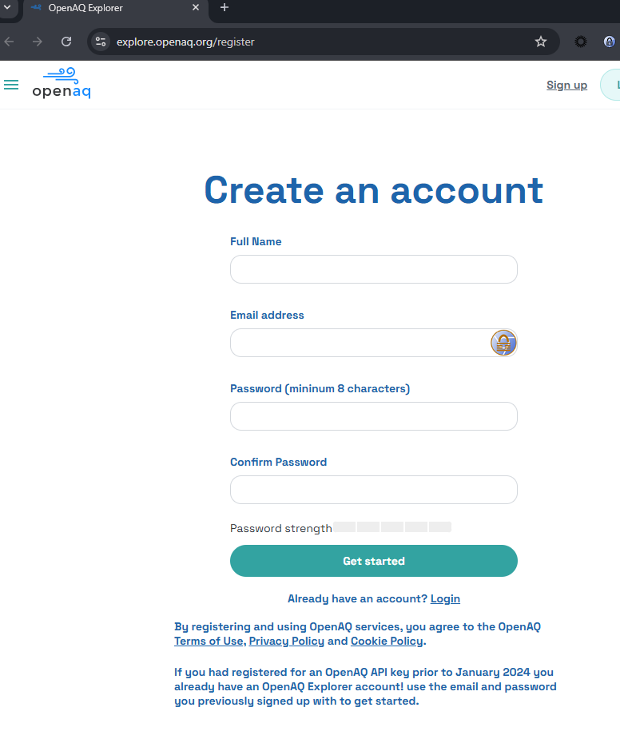
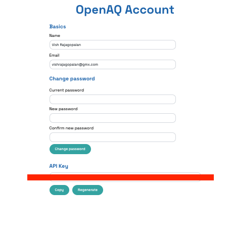

# Module 2: Designing Multi Agent Workflow On Agent Studio

With now a greater appreciation of the complexities in designing Agents by hand, let us now use Agent Studio to build the same workflow. In this Lab we will use Agent Studio to create the same Air quality Investigator System we built earlier.

**Goals**

- [ ] Create templates and workflows in Agent Studio  
- [ ] Learn how to set up agents, tools, and tasks  
- [ ] Build custom tools using Agent Studio  
- [ ] Test and deploy the workflow  
- [ ] Monitor the workflow  

## Requirements

- [ ]  Access to the Lab Tenant is already set up.
- [ ]  Agent Studio is already installed in the assigned Cloudera AI project.
- [ ]  OpenAi api key is already setup in the assigned Cloudera AI project.
- [ ]  OpenAQ api key needs to be setup to get AQI and temparature data.

## OpenAQ API Access Setup

* Create an Account in Open Air quality Website  at [https://explore.openaq.org/register](https://explore.openaq.org/register).

* Now Login to the OpenAQ account and generate API Key in account settings.

* Copy this API key and save it carefully in a notepad. You will need to access it later

## Labs

### Lab 1. Create Templates and Workflows in Agent Studio

**Goals**

- [ ] Get familiar with Cloudera AI Studios  
- [ ] Start creating agents in Cloudera AI Studios  

**➡️ [Go to Lab 1](./lab1.md)**

---

### Lab 2. Create Tasks in Agent Studio

**Goals**

- [ ] Create tasks for agents  
- [ ] Create dynamic inputs (imputation)  

**➡️ [Go to Lab 2](./lab2.md)**

---

### Lab 3. Create Custom Tools in Agent Studio

**Goals**

- [ ] Ensure agent workflows can connect to APIs and S3 buckets  
- [ ] Ensure agents have the required data to function  

**➡️ [Go to Lab 3](./lab3.md)**

---

### Lab 4. Test, Monitor, and Deploy Workflows

**Goals**

- [ ] Learn how to test the agentic workflow  
- [ ] Monitor workflow execution  
- [ ] Deploy the workflow as an application  

**➡️ [Go to Lab 4](./lab4.md)**

