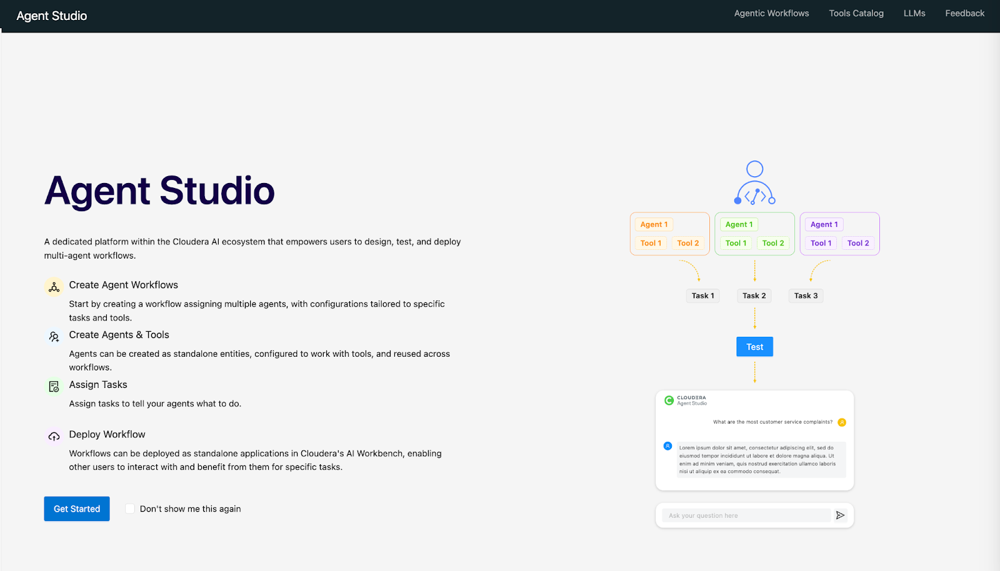
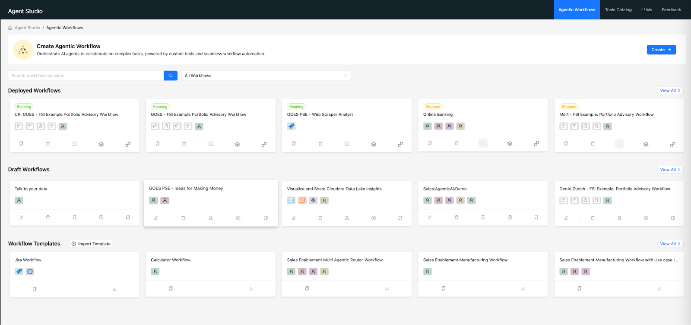
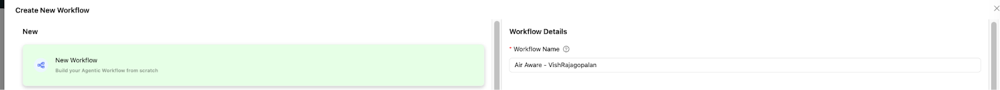
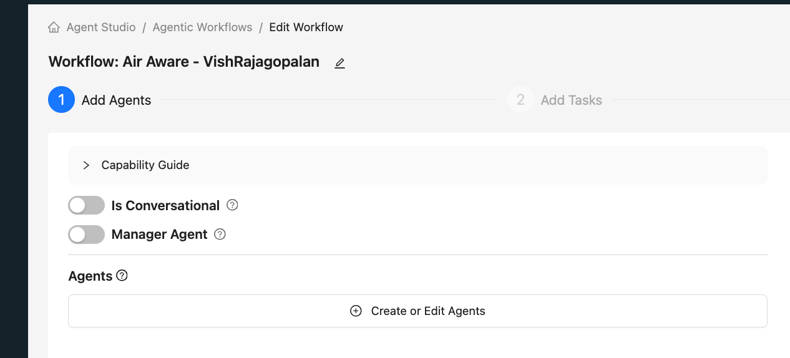
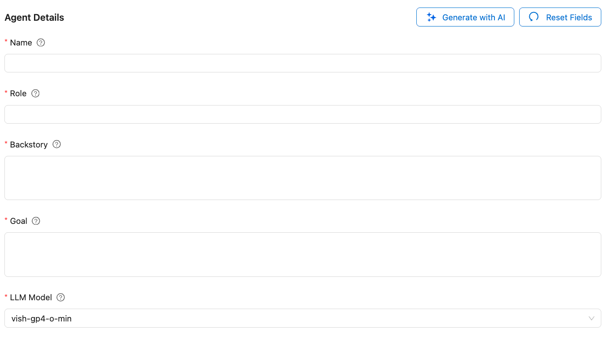
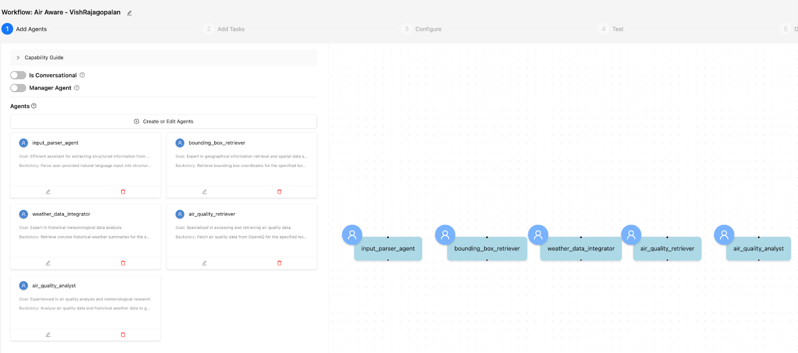

# Lab 1: Create Templates and workflows in Agent Studio

## Objectives

In this Lab we will use Agent Studio to create the Air quality Investigator System , we will learn:

- [ ] Create workflows in Agent Studio
- [ ] Learn how to set up 5 agents, tasks and tools

## Lab Steps

!!! warning "Important"
    Please ensure you use `aistudio-llm-model` as your LLM when creating agents

* Click on Agent Studio from the AI Studios Menu item on CAI Left Menu. You should see the Landing Page below.

* Click on Get Started Button to come to the Home Page for Agent Studio.

* Click on `Create` button to launch a Workflow Template wizard.

* Create a New template and give a name `Air Aware - XXX` ( user your name)

* Click on `Create Workflow` after entering the name.

* In the next screen , ensure "Conversational" and "Manager Agent" are disabled. We will discuss what these settings mean.

* Click on Create or Edit Agents using the template here. We will be creating a total of 5 Agents using this template

* **Agents Definition:** Use the cell values below against to define each agent. Copy the values in each cell against each type of agent in the code.

> [!WARNING]
> Please ensure you use `aistudio-llm-model` as your LLM when creating agents.

| Agent | Role | Backstory | Goal |
| :---- | :---- | :---- | :---- |
| input_parser_agent | Input Data Parser | Parse user-provided natural language input into structured parameters required for air quality analysis. | Efficient assistant for extracting structured information from user queries. |
| bounding_box_retriever | Geospatial Data Specialist | Retrieve bounding box coordinates for the specified locations. | Expert in geographical information retrieval and spatial data analysis. |
| weather_data_integrator | Historical Weather Data Specialist | Retrieve concise historical weather summaries for the specified locations and dates. | Expert in historical meteorological data analysis. |
| air_quality_retriever | Air Quality Data Retriever | Fetch air quality data from OpenAQ for the specified locations and date range. | Specialized in accessing and retrieving air quality data. |
| air_quality_analyst | Air Quality Analyst | Analyze air quality data and historical weather data to generate a report. | Experienced in air quality analysis and meteorological research. |

* We will not use any Tools at this point, we will add the tools later. Also we will not use any MCP Server at this point  

* Create the 5 Agents based on the data above.

* You can experiment with "Generate with AI" option to generate your prompt.

* After this you should be able to see 5 Agents as below.

## Learning Notes
- [x] Create workflows in Agent Studio
- [x] We have learnt how to start using AI Studios and create Agents

**:rocket: We have now concluded Lab 1 :rocket:**
