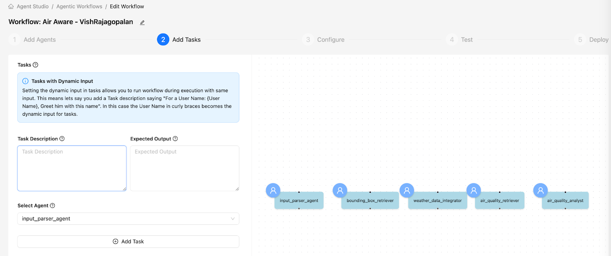
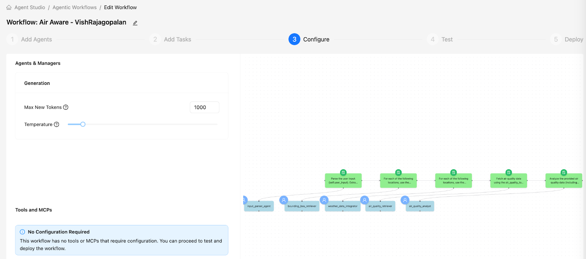
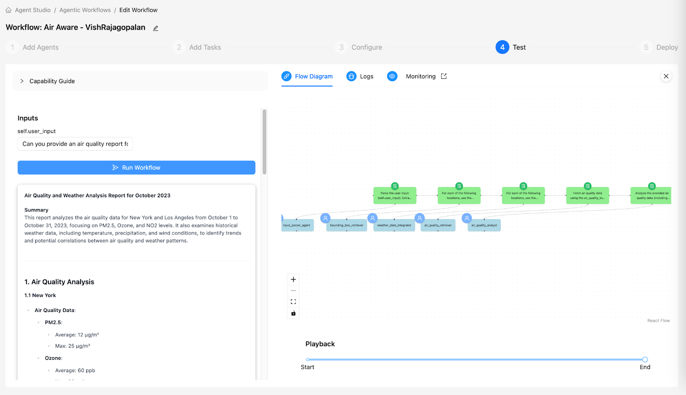

# Lab 2: Create Tasks in Agent Studio

## Objectives

- [ ] Create Tasks for each of the Agents
- [ ] Create Dynamic Inputs ( Imputation ) for the input from our input_parser

## Lab Steps

Now let us define the tasks for our Agents to work on.

* Start with the Tasks Screen shown below



| Description | Agent | Expected Output |
| :---- | :---- | :---- |
| Parse the user input: `{user_input}`. Extract locations, start date, end date, and air quality parameters using the `InputParserTool`. | input_parser_agent | A dictionary containing parsed `locations`, `start_date`, `end_date`, and `aq_parameters` from the user input. |
| For each of the specified locations, use the `bounding_box_extractor` tool to retrieve the corresponding bounding box coordinates. Return the bounding boxes associated with each location. | bounding_box_retriever | A dictionary or list containing the bounding box coordinates (`south`, `west`, `north`, `east`) for each specified location. |
| For each specified location, use the bounding box coordinates (`south`, `west`, `north`, `east`) along with the `start_date` and `end_date` to query the weather tool and retrieve a concise summary of relevant historical weather conditions during the specified period. Focus on key weather factors that may influence air quality, such as temperature, wind, and precipitation. | weather_data_integrator | A dictionary or list containing summarized historical weather conditions for each specified location. |
| Fetch air quality data using the `air_quality_tool` for each specified location from `start_date` to `end_date`, using only the corresponding bounding box coordinates. If specific parameters are provided through the `aq_parameters` attribute, focus on those parameters. Return the results as a pandas DataFrame. | air_quality_retriever | A pandas DataFrame containing air quality data for the specified locations, dates, and parameters. |
| Analyze the provided air quality data (including parameters such as `pm10`, `value`, `units`, `date`, and `location`) for the specified locations and dates. Consider the historical weather information (temperature, wind, precipitation, humidity) for the same period. Identify air quality trends, calculate relevant averages, and discuss potential correlations or influences of weather conditions on air quality. Generate a detailed report summarizing the air quality conditions for each location, highlighting key findings and notable weather-related observations. Include comparisons across locations and incorporate reliable domain knowledge to provide additional commentary on overall air quality conditions. | air_quality_analyst | A comprehensive air quality analysis report for each location, including trends, averages, and discussions on the relationship between air quality and historical weather conditions. The report should include a **Summary** section at the beginning and a **Conclusion** section at the end. |

* Click on `Save and Next` to go to the Configurations Page.  

* Set the Configurations to `1000` New Tokens as below.



* Let us now test the workflow. With the following user_input

    ```
    Can you provide an air quality report for Sydney from January 1, 2025, to January 3, 2025, focusing on the PM2.5 parameter?
    ```

* As you can see the LLM is now hallucinating and generating data for New York and Los Angeles in Oct 2023 etc.



> [!NOTE]
> While we have set up Agents and Tasks, the default LLM lacks the ability for us to build a **Trustworthy Investigative System**.
>
* In the next section, we will use Custom Tools to generate a more accurate and trustworthy report.

## Learning Notes

In this Lab

- [x] we learnt how to set up Tasks and associate them with Agent.

- [x] We also saw that only using Prompts lacks the ability to generate a good quality output  

**:rocket: We have now concluded Lab 2 :rocket:**
