# Lab 4: Test, Monitor and Deploy Workflows

## Objectives

- [ ] In this Lab, we will test our Agentic Workflow, Monitor it and Deploy it as an Application

## Lab Steps
* Click on your workflow in edit mode from the home page
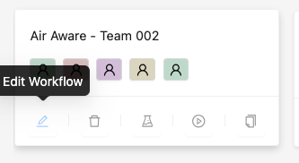
* Click on the capability description and add the below text into the text box under Capability guide

```text {.prompt-block}
“Air Aware” 워크플로우는 지정된 위치에 대해 특정 날짜 범위 동안의 대기질을 종합적으로 분석하기 위해 설계되었습니다. 이 과정은 여러 전문 에이전트(agent)와 작업들로 구성되어 있으며, 이들이 협력하여 목표를 달성합니다.
워크플로우는 먼저 각 위치의 바운딩 박스(bounding box) 좌표를 조회하는 것으로 시작되며, 이 좌표를 기반으로 기온, 풍속, 강수량 등 대기질에 영향을 미치는 요소들에 대한 과거 기상 데이터를 수집합니다.
동시에 OpenAQ로부터 대기질 데이터를 가져오는데, 사용자가 특정 파라미터를 지정한 경우 그 항목에 중점을 둡니다.

이렇게 수집된 데이터는 이후 분석되어,
- 대기질의 변화 추세
- 관련 평균값
- 기상 조건과 대기질 간의 잠재적 상관관계
등을 파악합니다.

최종적으로 각 위치에 대한 상세 보고서가 생성되며, 이는 해당 기간 동안의 대기질 상황을 요약하고, 주요 발견 사항과 기상 패턴에 따른 의미 있는 관찰 내용을 포함합니다.

사용자 입력 예시 : 
2025년 1월 1일부터 2025년 1월 3일까지 서울의 대기질 보고서를 초미세먼지 2.5 파라미터 중심으로 제공해줄 수 있나요?

```

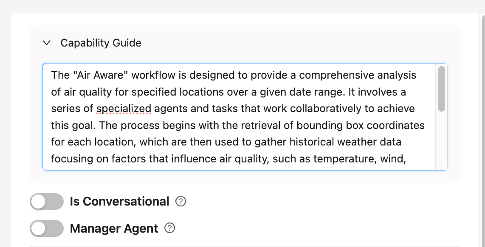

* Click on `Save & Next` until you reach the _Configure_ step in the workflow as shown below.

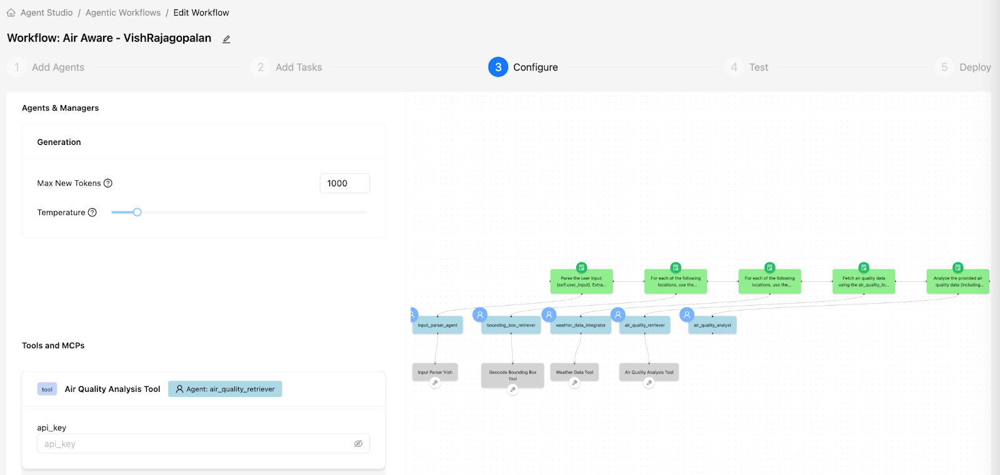

* Enter the API Key you created from the Open AQ website in step [OpenAQ API Access Setup](./README.md). Click `Save & Next`


* Test the workflow by adding the following text in `user_input` text box below

```text {.prompt-block}
Can you provide an air quality report for Sydney, Australia  between 01.Jan.2025 to 03.Jan.2025 focussing on pm25 parameter?
```

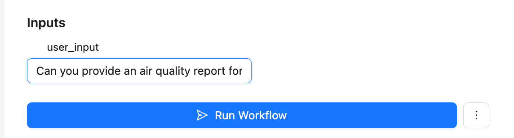

* Click on the `Monitoring` Icon Tab to monitor your workflow using Phoenix

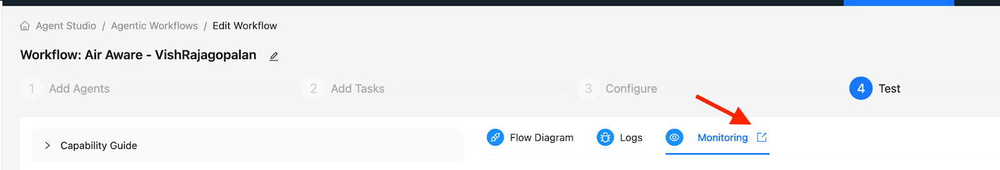

* You should be able to use Phoenix to monitor your workflow by clicking on the name of your Project as shown below.

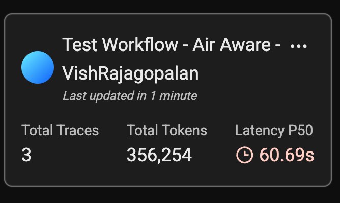

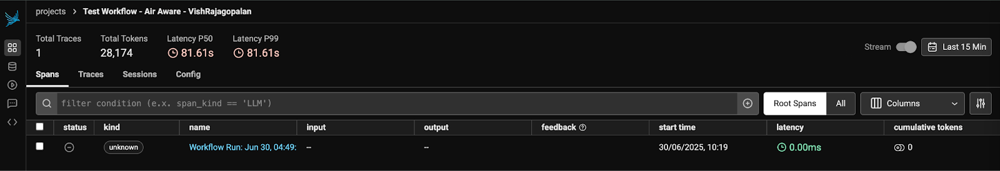

* Check the workflow for each tool. For example the below shows the workflow for the Input Parser Agent, which has used the tool to parse the user input

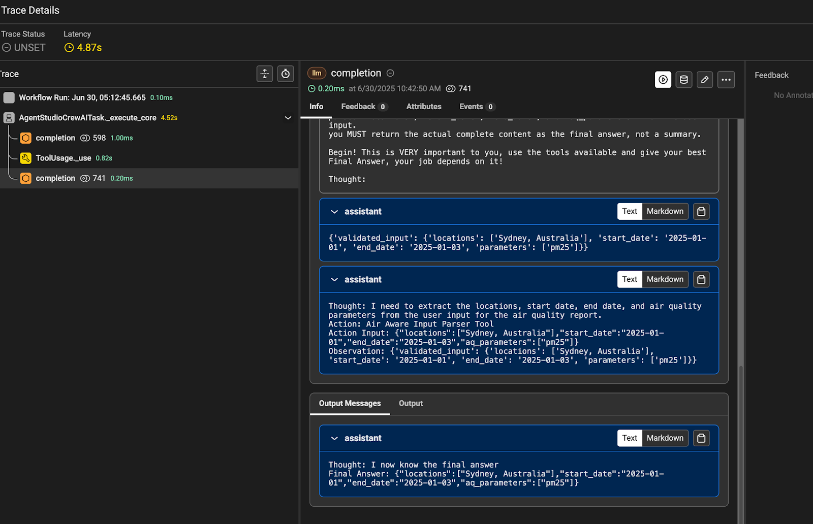

*  If the Workflow has executed properly, you should be able to see the output below as a final Air quality report the user is expected to
get.

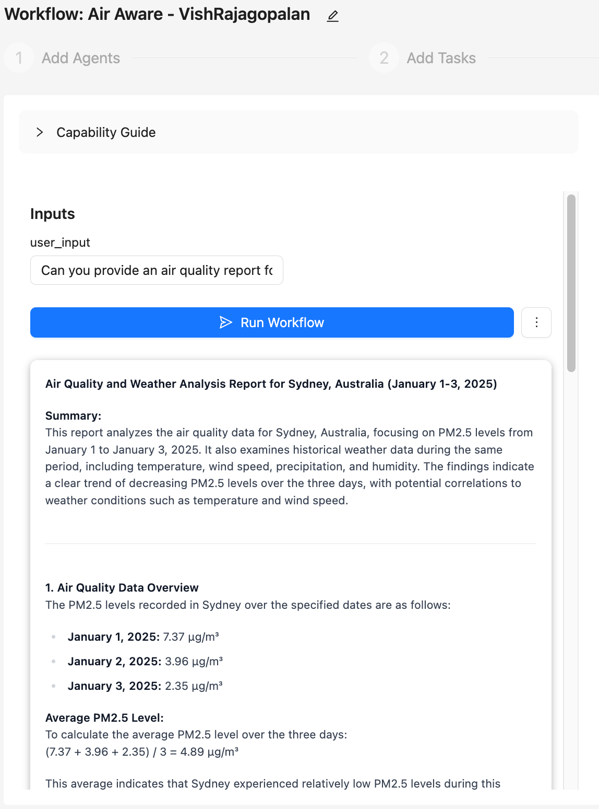

* Click on `Save & Next`, and first save your workflow as a Template and then `Deploy`.

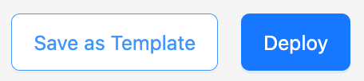

!!! note 
    It may take between 5-10 minutes to deploy your application

* You may need to open the workflow again and click on the `Actions` Menu item to deploy.

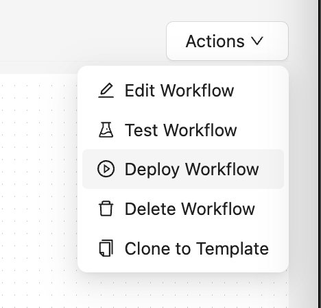

* Once deployed successfully, you should be able to see the workflow in the main Deployed Workflows section as below.

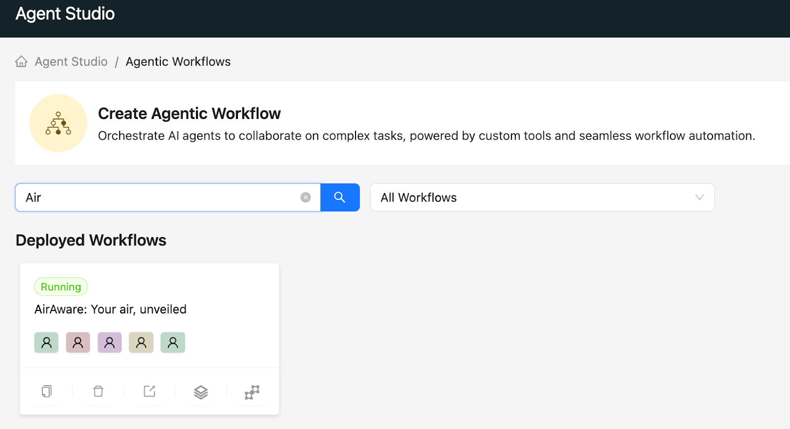

* Now let us run this Deployed workflow just as a normal user would . Click on the application link as shown below

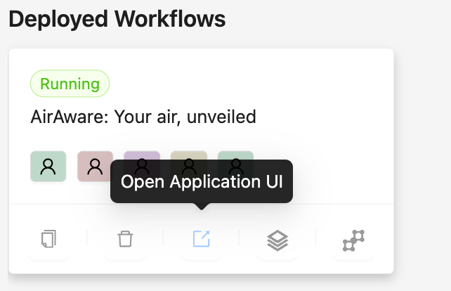

* This should open a UI Page below, let us test with user_input comparing Air Quality of 3 cities by entering the following input

```text {.prompt-block}
Can you provide an air quality report for Melbourne between 01.Jan.2025 to 03.Jan.2025 focussing on pm25 parameter
```

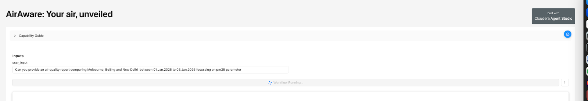

* After a few minutes you should be able to get a complete Air Quality report (partially shown in the screenshot below)

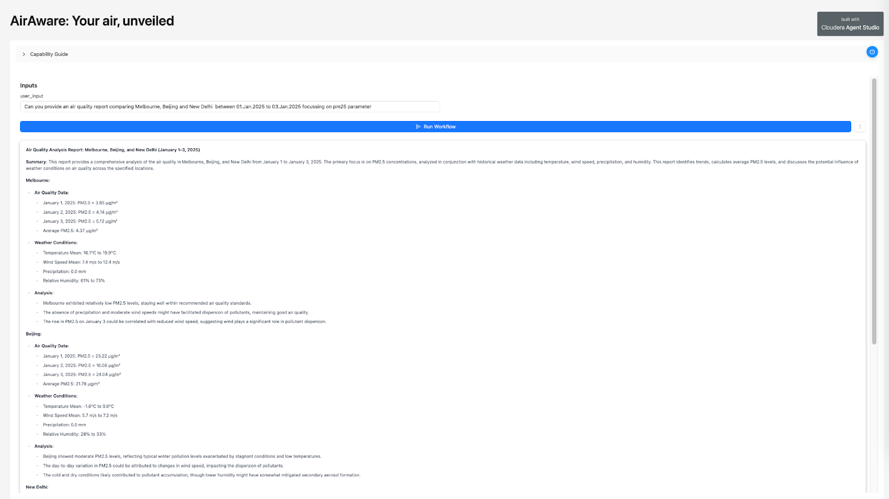

* Scroll down to download the entire report on your laptop.

## Learning Notes

- [x] In this lab we learnt how to test our Agentic Workflow, Monitor it and Deploy it as an Application

**:rocket: We have now concluded Lab 4 :rocket:**

**:rocket: This concludes our Hands on Workshop :rocket:**
