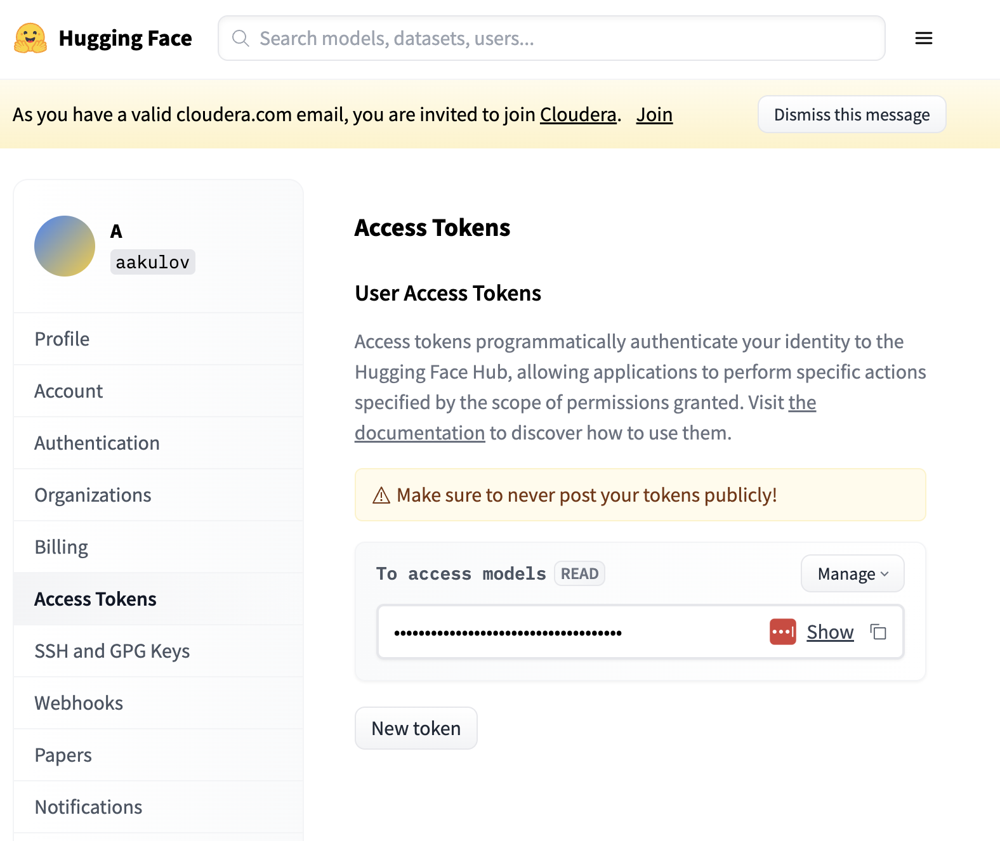
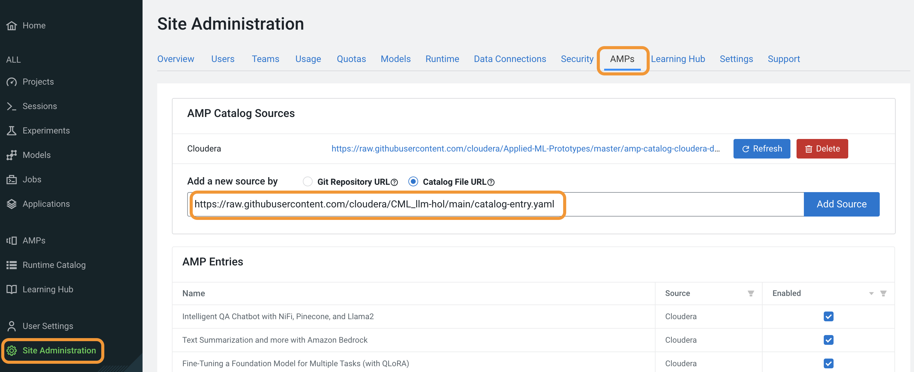
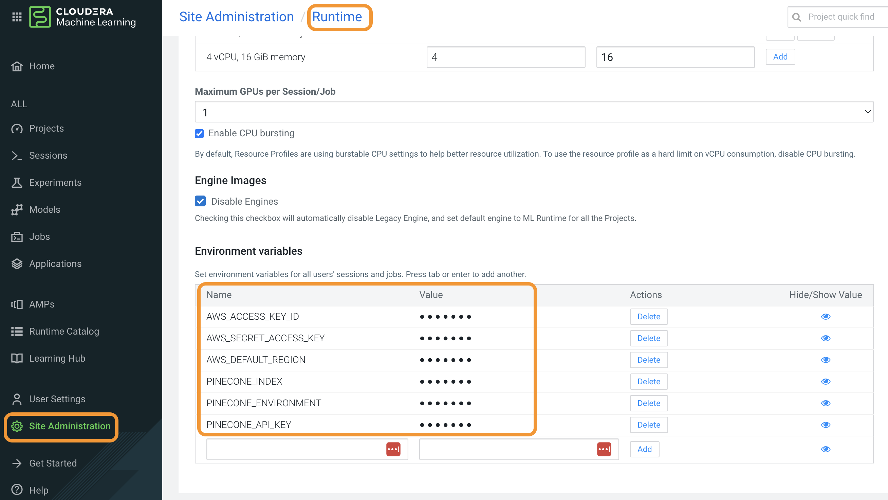
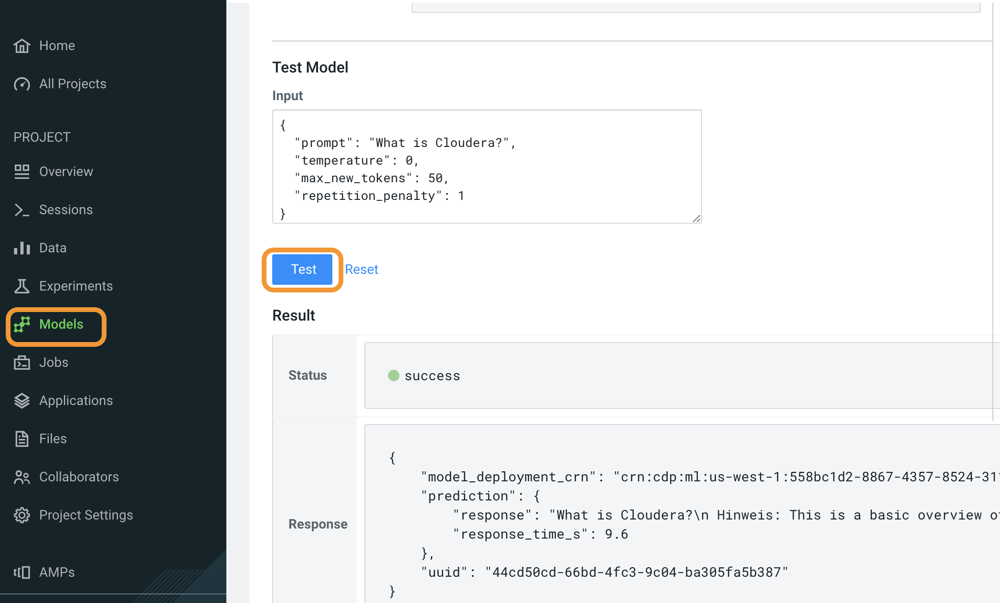

# LLM Hands-on Lab Setup for CML

By following the steps below you'll have everything you need to setup an environment for LLM-focused CML Hands-on Lab. This guide is meant to be followed in the order presented. Here's a quick overview of the process.

1. [Ensure you meet pre-requisites](#1-meet-the-pre-requisites). You can run the lab in Sandbox or workshop or marketing tenant, so you'll need credentials from the respective AWS account and CDP tenants. You'll also need a HuggingFace account.
2. [Create ML Workspace and CDP Environment](#2-create-cdp-environemtn-and-ml-workspace). Fresh environment ensures everything is setup with the workshop requirements in mind.
3. [Configure ML Workspace](#3-configure-ml-worksapce-for-llms) with additional, manual steps to get things ready.
4. [Launch shared model](#4-launch-shared-model-using-amp) that participants will rely on in some of the exercises. 
5. [Launch participant AMPs](#5-launch-participant-amps) for each user, using automation.
6. [Plan and Pre-warm the Environment](#6-pre-warm-the-environment). This is essential to reduce the participants' wait time during the lab. 
7. [The Taredown](#7-teardown) removes all CDP and collateral AWS resources.

## 1. Meet the pre-requisites
####  1.1 Have [Docker](https://www.docker.com/products/docker-desktop/) running. 
Installing Docker is out of scope of this document. To test that docker is running just execute ```docker``` in your command line and the expected output should start with ```Usage: docker [OPTIONS] COMMAND```. Once you see that you are ready for next step.

There have been reports that on Mac M1 chips Docker hangs. There are alternative ways to run cloudera-deploy, but they outside of the scope of this guide. Contact GOES team if you have trouble.

#### 1.2 Create or identify your AWS profile for the AWS account you'll be using
On your machine, navigate to your aws credentials directory and check the profile setup. 
```
cat ~/.aws/config
``` 
If you already have the AWS profile for the workshop configured, great! Export the profile name as an environment variable ```export AWS_PROFILE=<YOUR-AWS-PROFILE-NAME>```. If not, make sure to follow the formatting for [AWS configuration files](https://docs.aws.amazon.com/cli/latest/userguide/cli-configure-files.html). Example configuration for Sandbox SE environment is below.
```
[profile llmhol]
sso_start_url = https://cloudera.awsapps.com/start
sso_region = us-east-1
sso_account_id = <SSO_ACCOUNT_ID - numeric>
sso_role_name = <cldr_poweruser - for SE envts., but not marketing tenant>
region = us-east-2
output = json
```
You can validated that everything is working by running ```aws configure list --profile <YOUR-AWS-PROFILE-NAME>``` and getting no errors in the output. Then export the name as an environment variable.

**Important** make sure you are logged in via AWS CLI by executing ```aws sso login --profile=$AWS_PROFILE```.

**Important 2** if you see an error like ```ForbiddenException No access```, then remove SSO-related lines from the AWS profile file and try again.

#### 1.3 Create or identify your CDP prfile for the tenant you'll be using
On your machine, navigate to your cdp crednetials directory and check the profile setup. 
```
cat ~/.cdp/config
```
If you already have a CDP profile for the workshop configured, export the name as an environment variable ```export CDP_PROFILE=<YOUR-CDP-PROFILE-NAME>```. and move on to the next step. Otherwise, go throug the steps outlined in [CDP CLI configuration](https://cloudera.github.io/cdp-dev-docs/cli-docs/configure/index.html). To confirm all is good run ```cdp configure list --profile <YOUR-CDP-PROFILE-NAME>``` and ensure there are no erorr. Then export the name as an environment variable. 

#### 1.4 Get your HuggingFace access token ready
The model that will be hosted in CML for this lab is Mistral 7B. Until April 2024, this model was not gated on the HuggingFace website, but now it is. Therefore, you will need to 
1. Create a [Hugging Face account](https://huggingface.co/join) if you don't already have one. Confirm your email if you are creating a new account.
2. Generate or retreive an Access Token from user settings on the Hugging Face website. Save this token somehwere as you'll need it later.

3. While logged in, navigate to [Mistral 7B page](https://huggingface.co/mistralai/Mistral-7B-Instruct-v0.2) on Hugging Face website and click accept. 


#### 1.5 Make sure Anthropic Model is available to your AWS account through AWS Bedrock
Part of the lab will rely on making calls to AWS Bedrock, using the credentials you setup in step 1.2. However, it's not a given that these credentials are authorized to access the specific model we need for this worksop. To make sure everything works, do the following:
1. Go to the AWS Console for the account you'll be using for the lab.
2. Go to Amazon Bedrock service. Click Get Started if you get a splash screen.
3. In the left side panel click on Base Models and choose list view.
   
4. A white circle next to Claude v2.1 indicates that the model is active/enabled for your account, while a grey circle means you need to enable it. 
5. If you need to enable Claude v2.1 then click on the model, scroll down, and click Request Model Access button. Follow the steps to get access to the model. The result should look like this: 


## 2. Create CDP Environemtn and ML Workspace

#### 2.1 Install ansible-navigator and 
Follow the [Installation steps](https://github.com/cloudera-labs/cldr-runner/blob/main/NAVIGATOR.md#installation). You _only_ need to do the installation steps, then come back to this guide. The result of this step should look something like this:


#### 2.2 Setup and Configure YAML definition
Follow the [Set Up and Configure](https://github.com/cloudera-labs/cloudera-deploy/blob/main/public-cloud/aws/cml/README.md#set-up) steps in cloudera-deploy repo. You _only_ need to do the Set Up steps, then come back to this guide. Make sure the virtual environment has the ```AWS_PROFILE``` and ```CDP_PROFILE``` environment variables set and that you are logged in with aws CLI (e.g. when using sso you'll need to do ```aws sso login --profile=$AWS_PROFILE```).

**IMPORTANT**. Replace the definition.yml in the ```./cloudera-deploy/public-cloud/aws/cml``` directory with the yml from this repository. It is importat you customize the name prefix in that file to avoid any collisions with any previously created environments (especially collisions around bucket names). Also, optionally change the password in the definition.yml file. 

:exclamation: As of [CDP Public Cloud 7.2.18](https://docs.cloudera.com/management-console/cloud/release-notes/topics/mc-whats-new.html#pnavId4), Medium duty Data Lake is no longer supported. As a workaround for now set ```scale: LIGHT_DUTY``` in the definition.yaml.

#### 2.3 Execute the ansible runbook to create CDP Environment and ML Workspace
```
ansible-navigator run main.yml
```
You should see an interface like below, with the status Running in the bottom right corner. You can drill into any particular stage by pressing the number of that stage. _Esc_ to go up a level or quite the process entirely.


Once the setup reaches step _Set up CDP Public Cloud_, after about 15 minutes, you can check in CDP Control Plane that your environment is being created. 
 
From here, environment setup can take another 1.5 hours or more. ML Workspace creation alone takes ~45 minutes.

## 3. Configure ML Worksapce for LLMs
Once your ML Workspace is provisioned, you'll need to configure a few additional things manually to make sure everything works.

#### 3.1 Confirm that the right GPU type is provisioned in the workspace
In [step 2.3](#23-execute-the-ansible-runbook-to-create-cdp-environment-and-ml-workspace) the yaml definition should provision the correct GPU type. Here we just double check that it indeed worked. 
1. Navigate to Machine Learning in the Control Plane
2. In the row for your ML Worksapce, click on the kebab dots, then _View Worksapce Details_ 
3. Scroll down to _Workspace Instances_ and ensure GPU workers lists ```g4dn.4xlarge``` instance type or better.

#### 3.2 Confirm network access to the ML Workspace
Here we check that the ML Workspace you have provisioned is in fact accessible for users other than yourself. Note that CDP control plane is accessible to everyone, but the ML Workspace provides additional set of network ingress restrictions. 
1. Navigate to Machine Learning in the Control Plane
2. In the row for your ML Worksapce, click on the kebab dots, then _View Worksapce Details_ 
3. Scroll down to _Network Settings_ and check that it's configured as shown in the screenshot below.


#### 3.3 Increase Emphemeral Storage Limit
In your workspace, under _Site Administration_ do the following:
1. Go to _Settings_ tab
2. Scroll down to _Ephemeral Storage Limit (in GB)_ and change the value to **20**. 

#### 3.4 Add LLM HoL AMP catalog to the workspace
In your workspace:
1. Go to _Site Administration_ in the left sidebar menu
2. Click on _AMPs_ tab
3. Choose the _Catalog File URL_ radio option
4. Enter ```https://raw.githubusercontent.com/cloudera/CML_llm-hol/main/catalog-entry.yaml``` in the text field  
5. Click _Add Source_
Result should be no errors and new catalog entry listed under _AMP Catalog Sources_

#### 3.5 Define global environment variables
Here we setup environment variables that will be automatically included in the participant projects, when they are launches via AMPs. Note that you may want to create separate user in AWS, with access to Bedrock. Generate new keys for that user and supply those below.
1. Go to _Site Administration_ in the left sidebar menu
2. Click on _Runtime_ tab
3. Scroll down to _Environment Variables_ section and add the following: 
* AWS_ACCESS_KEY_ID - _you can reuse from your profile, or create new_
* AWS_SECRET_ACCESS_KEY - _reuse or create as above_
* AWS_DEFAULT_REGION - _us-west-2 is a good one, [check here](https://docs.aws.amazon.com/bedrock/latest/userguide/bedrock-regions.html)_
* PINECONE_INDEX - _create a free index via starter account_
* PINECONE_ENVIRONMENT - _where your index resides_
* PINECONE_API_KEY - _key to access your index_



#### 3.6 Add Users/Groups to Your ML Workspace
In this step you will make sure that each participant user (user001-user100) is granted MLUser role and they are able to interact with the ML Workspace that you've created for the lab. 
1. Go to _Control Plane console_ > _Environments_ > _Your CDP Environment_
2. Click _Actions_ > _Manage Access_
3. In the search bar type in the name of the group that the users belong to (see here for [reference](https://cloudera.atlassian.net/wiki/spaces/CSME/pages/450101379/Running+a+CDP+Public+Cloud+Workshop#User-account-access-for-all-workshop-tenants-is-now-managed-by-Keycloak))
4. In the pop-up window check _MLUser_ role and click _Update Roles_ at the bottom
5. Finally, hit _Synchronize Users_

Now when, for example, user027 logs in with his or her SSO credentials, they will be able to view and enter the ML Workspace created in step 2.3. 

## 4. Launch Shared Model using AMP
In this step you will launch an AMP that deploys an LLM as a CML model deployment. 
1. Click on _AMPs_ in the left sidebar menu of your ML Worksapce
2. Find an AMP card titled ```Shared LLM Model for Hands on Lab``` and click on it
3. Click on _Configure Project_
4. Leave all settings as is and click _Launch Project_
:hourglass_flowing_sand: The full launching process takes **approximately 20 minutes**, with model building taking ~10min and model deployment another ~10min. If it's taking longer than 35, it's time to return to [step 3.1](#31-confirm-that-the-right-gpu-type-is-provisioned-in-the-workspace) and double check that everything has been setup correctly. 
5. Once model is deployed, go to the project. It will be titled _"
Shared LLM Model for Hands on Lab - <YOUR-USERNAME>"_. 
6. Go to _Models_ in the left sidebar. 
7. Click on _Llama-2-7b_
8. Under _Test Model_ click the blue _Test_ button. In a few seconds you should see an output like below. 
Congratulations, you've deployed an LLM that can be shared by your participants for the Hands-on Lab.
9. Go to _Project Settings_ and change the project name to simply be ```Shared LLM Model for Hands on Lab```, without any dashes or username at the end.
10. On the same screen in _Project Settings_ make the project public. This is essential for the participants to be able to use the shared model.
11. After the model is launched, go to _Site Administration_ > _Runtime_ tab and scroll down _Maxiumum GPUs per Session/Job_ and set it to 0. This will make sure participants do not mistakenly spin up session with GPUs. None of the participants exercises require a dedicated GPU session.

## 5. Launch Participant AMPs
Here we will use a browser automation plugin called Selenium to go through the tedious process of launching an AMP for each participant in the workshop. Alternatively, this can be done manually, as a fall back when the automation is not working. 

These steps need to be done on your machine, rather than inside of a docker container.

#### 5.1 Setup automation and test 
This step requires a download of a Chrome plugin to be able to automate the task of logging into CDP, going to your ML workspace, and lauching an AMP with the right environment variable parameters. 

Download the right version for your machine from here: https://googlechromelabs.github.io/chrome-for-testing/. Time to time the specific driver needs to be updated, as you update your browser. 

A Mac may prevent you from running the executable chromedriver, so you'll need to add it in your Privacy & Security settings to trusted apps. 
* Clone this repo `git clone https://github.com/cloudera/PSEAutomation.git[https://github.com/cloudera/PSEAutomation.git]`
* Navigate to amplifier folder ```cd Participant_amps/amplifier```
Next, perform the following the steps to set everything up and run a simple test:
* Place **chromedriver** executable you've downloaded into this directory
* Create and activate a virtualenvironment ```python3 -m venv .; source ./bin/activate```
* Install selenium package ```pip3 install selenium``` and install pandas ```pip3 install pandas```
* Run the test script ```python3 selenium-test.py```
* You should see a new browser window open, automatic navigation to cloudera docs, followed by navigation to CML docs home page. **DO NOT** interact with the browser during the test.
* Once the test finishes, you should see ```ALL TEST PASSED!``` in the console. You are ready to move on to bulk AMPs creation.

#### 5.2 Run Bulk AMP creation
In this step you will run an automation script that launches an AMP for each paricipant. First, a few configuration steps:
1. Make sure all of the participant credentials are listed properly in ```participants.csv```
2. Open up ```amplifier.py``` and edit three global variables at the top:
    * **SSO_URL** - set it to the URL you use to get to the SSO interface of your CDP tenant (e.g. sandbox or marketing tenant). The file currently has a sample from a previous workspace for reference.
    * **ML_WORKSPACE** - set it to the name of your ML workspace
    * **AMP_NAME** - set it to the name of the AMP that you've given the lab after uploading the catalog to the workbench (i.e. **"Hands on Lab Workshop with LLM"**)
3. Save the ```.py``` file
4. Get yourself a coffee, the next step will take a while. For every 5 AMPs expect to wait about half an hour. For a 50 person workshop, the AMP creation will take approximately 2.5 hours. 
5. While in the ```amplifier``` directory, in the command line execute ```python3 amplifier.py```.

Check the logs (stdout) periodically to make sure things are progressing. You may need to baby sit this automation since any latency in loading the Cloudera AI website may break the automation. In that case, make sure to verify which users' AMPs were successful and do not re-create them. Remove the users from the CSV file.

## 6. Prepare Compute Resources for the Lab
#### 6.1 Planning Resources for the Lab
This lab uses both CPU Workers and GPU Workers. The resources are linearly proportional to the number of participants you'll host. Use the following formulas to determine how much CPU, memory. and GPUs you are going to need. Based on that determine the minimum scaling range for your ML Workspace.

```
Cores = (# of participants) x (7)
Memory = (# of participants) x (14)
GPU Workers = ((# of participants) / 4 )
```

**IMPORTATNT** You need to check the AWS limits (Service Quota Dashabord) for the resource types you will be using. This includes total number of instances of each type that your AWS account is allowed to deploy in a given region, as well as quotas like _Running On-Demand G and VT instances_ that govern the total number of CPUs of a given instance type you can deploy at once.

#### 6.2 Pre-warm the Environment
A few hours before the start of the lab session, you'll need to spin up minimal resources to support the total laod the participants will put on your ML Workspace. 

You will need to restart the model with the number of replicas equal to the number of GPU Workers set above. This will ensure quicker response time for participants in the lab. **IMPORTANT** make sure that the runtime profile you use is at least 4 CPU x 16 GB RAM per each model replica AND has 1 GPU per replica as well.

## 7. Teardown   
It's important to [teardown](https://github.com/cloudera-labs/cloudera-deploy/blob/main/public-cloud/aws/cml/README.md#tear-down) the environment via cloudera-deploy, rather than doing it using the control plane. 


## Appendix
Some JIRAs to track:
* Wrap text in Model test UI https://jira.cloudera.com/browse/DSE-10989
* Launch AMPs via APIv2 https://jira.cloudera.com/browse/DSE-33804
