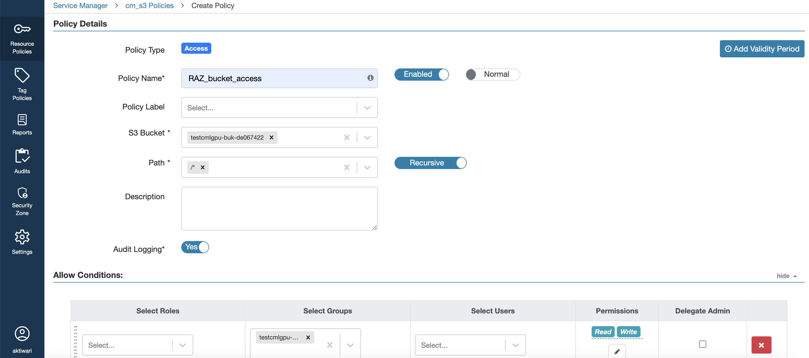
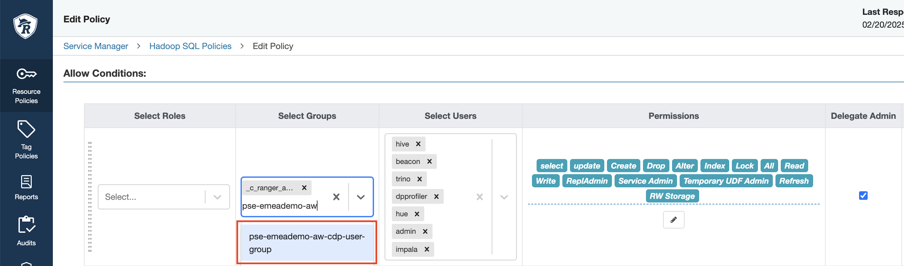
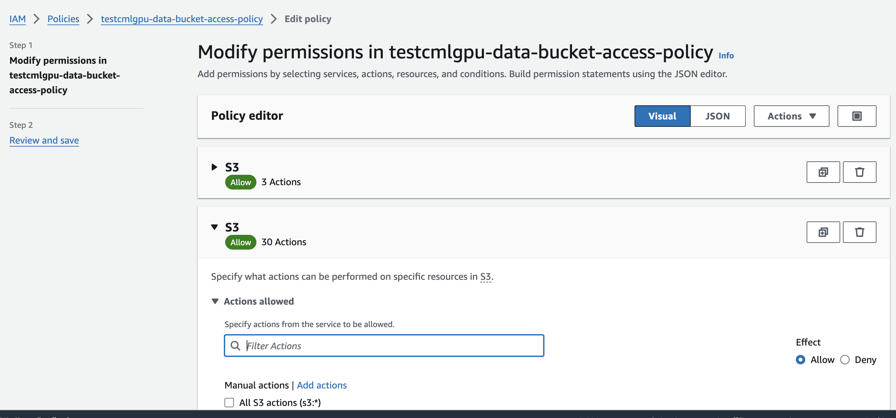
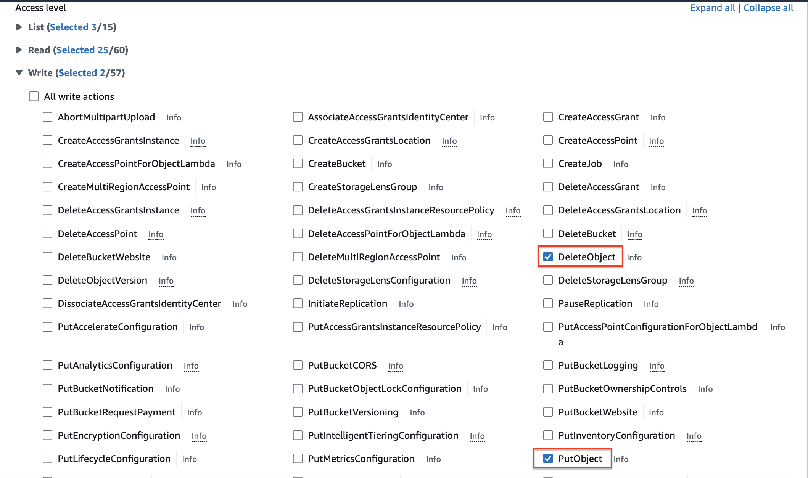
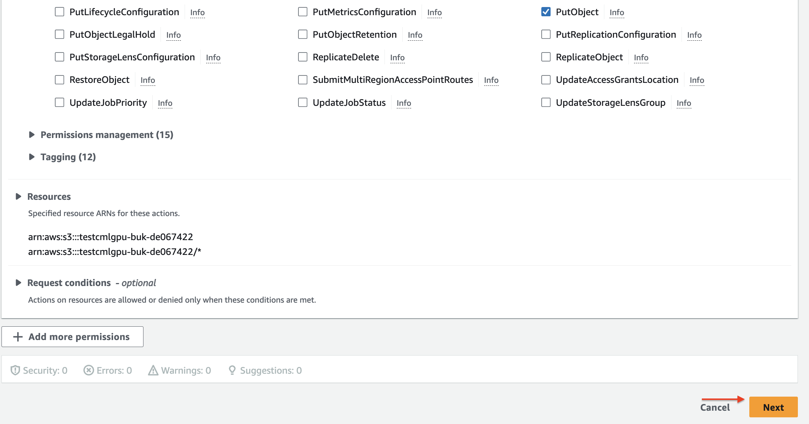

== Overview

This guide provides instructions for setting up, validating, and destroying the environment for our workshop. Use the navigation links below to quickly jump to each section.

== INIT

* Environment and Keycloak Creation

For environment and Keycloak creation, use the following automation:

link:https://github.com/cloudera/ClouderaSetup/tree/main/OnCloud/AWS[GitHub Repository]

[NOTE]
====
Ensure you have all necessary permissions and configurations before proceeding with the automation scripts.
====

* Data Upload

Once the environment and the Keycloak servers are created, upload the data to the object store. This data will be used to create tables during the workshop.

Before executing workshop steps, first copy `airlines.csv` from link:../data/airlines.csv[Data Directory] to current workshop_bucket and Create Ranger Policy for RAZ-Enabled AWS Environment.

== Copy data in workshop bucket

[.shell]
----
aws s3 cp airlines.csv s3://<bucketname>/airline_lab/raw/airlines.csv
----

The final directory structure on S3 should look like

s3://<bucketname>/airline_lab/raw/airlines.csv

== Creating Ranger Policy for RAZ-Enabled AWS Environment

After you register the RAZ-enabled AWS environment, you can log in to Ranger to create policies for granular access to the environment's cloud storage location. To create the Ranger policy, you must first create the required S3 policy and then a Hive URL authorization policy on an S3 path for the end user.

=== Creating the Required S3 Policy

To create the required S3 policy on an S3 path for an end user, perform the following steps:

. Navigate to the Ranger UI.
. On the `S3` tab, click `cm_s3`.
. Click `Add New Policy` in the top right corner.
. Provide the following policy details:
  .. Enter _Policy Name_.
  .. Enter an _S3 Bucket_ name.
  .. Provide a _Path_ within the S3 bucket.
  .. Select _Groups_ and _Permissions_ to assign to the end user.
+
**Only Read and Write permissions can be assigned to the end user.**
+

. Click `Add` to save the policy.

=== Modifying the Hadoop SQL Policy

To modify the Hadoop SQL Policy to allow access to databases for the end user, perform the following steps:

. Navigate to the Ranger UI.  
. On the `Hadoop SQL` tab, click `Hadoop SQL`.  

. Search for policy number 10 (all - database, table) and 15 (all - url) one by one, click the pencil icon on the right to edit. 
. In the **Allow Conditions** section, under `Select Groups`, search for and add the CDP group named <workshop_name>-aw-cdp-user-group.
+  
 

. Click `Save` to save the policy.  

== Updating **data-bucket-access-policy** on AWS

. Sign in to AWS Console and navigate to IAM under Security, Identity, & Compliance.
. Click Policies, search for the policy `<workshop-name>-data-bucket-access-policy`, and select it.
. Click Edit policy, then choose Visual editor.
. Under Service, select S3.
. Under Actions, check PutObject and DeleteObject.
. Click Next and Save the changes.

== Establishing Connectivity to Data Warehouse from end user machine
Whitelist the end users IP address against port `443` in `knox_sg` security group to allow connectivity to Data Warehouse from end user machine.
