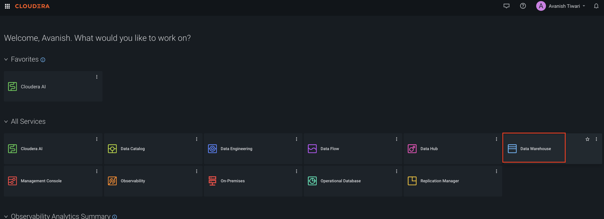
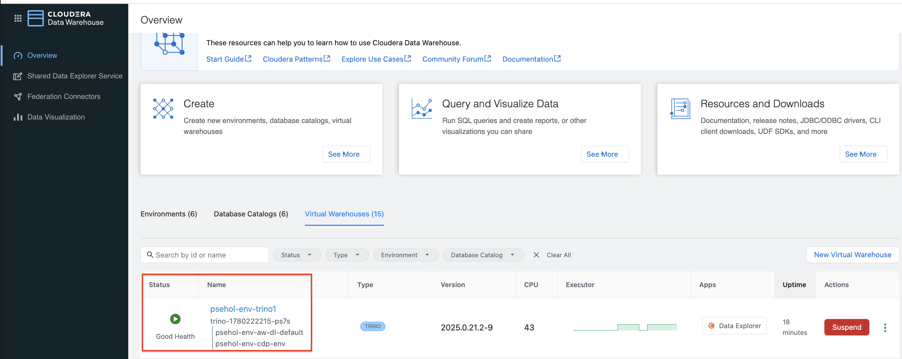

= Run Analytics on the Airline Dataset with Trino on Cloudera Data Warehouse
:toc: macro
:toclevels: 3
:icons: font
:source-highlighter: rouge
:experimental:

Table of Contents

link:#overview[*Overview*]

** link:#what-you-build[What you build]
** link:#what-you-learn[What you learn]
** link:#what-you-need[What you need]
** link:#architecture[Architecture]
** link:#estimated-time-and-cost[Estimated time and cost]

link:++#lab-0---before-you-begin++[*Lab 0 - Before you begin*]

** link:#verify-your-cdp-access[Verify your CDP access]
** link:#capture-your-connection-parameters[Capture your connection parameters]
** link:#set-up-your-local-environment[Set up your local environment]

link:++#lab-1---data-setup++[*Lab 1 - Data Setup*]

** link:#step-1-upload-raw-data[Step 1 : Upload raw data]
** link:#step-2-create-iceberg-schema-and-tables[Step 2 : Create Iceberg schema and tables]
** link:#step-3-load-data-via-trino[Step 3 : Load data with Trino]
** link:#verify-lab-1[Verify]

link:++#lab-2---data-exploration++[*Lab 2 - Data Exploration*]

** link:#step-1-connect-from-jupyter[Step 1 : Connect from Jupyter]
** link:#step-2-run-analytical-queries[Step 2 : Run analytical queries]
** link:#verify-lab-2[Verify]

link:++#lab-3---advanced-queries++[*Lab 3 - Advanced Queries*]

** link:#window-functions-and-ctes[Window functions and CTEs]
** link:#joins-and-performance-tuning[Joins and performance tuning]
** link:#verify-lab-3[Verify]

*link:++#lab-4---cloudera-specifics++[Lab 4 - Cloudera Specifics]*

** link:#iceberg-table-format[Iceberg table format]
** link:#ranger-security-integration[Ranger security integration]

link:#clean-up[*Clean up*]

link:#troubleshooting[*Troubleshooting*]

link:#whats-next[*What's next*]

link:#glossary[*Glossary*]

== Overview

This workshop teaches you how to query a global airline passenger dataset with https://trino.io/[Trino] on https://docs.cloudera.com/data-warehouse/cloud/index.html[Cloudera Data Warehouse (CDW)], using https://iceberg.apache.org/[Apache Iceberg] as the table format. You start with a raw CSV file, load it into a managed Iceberg table, and progress from exploratory SQL to production-grade analytical queries.

The content follows a codelab structure: each lab states an explicit objective, walks you through a short sequence of steps, and ends with a verification query so you can confirm the step succeeded before moving on.

=== What you build

By the end of the workshop you have:

* A partitioned Apache Iceberg table (`iceberg.airline_lab.flights`) populated from a Kaggle airline dataset.
* Two reusable Python notebooks that query the table with both the native `trino-python-client` driver and with `SQLAlchemy`.
* A set of `.sql` scripts you can run directly from the CDW SQL editor.

=== What you learn

* How to connect to a Trino Virtual Warehouse from Python using workload credentials.
* How to use the Hive catalog for CSV staging and the Iceberg catalog for managed storage.
* How to write window functions, CTEs, and join-heavy queries in Trino.
* How to read `EXPLAIN ANALYZE` output and apply basic performance tuning.
* How Cloudera-specific features - Iceberg hidden partitioning, time travel, and Ranger policy enforcement - behave in a real CDW deployment.

=== What you need

* A Cloudera Data Platform (CDP) environment (Public Cloud or Private Cloud) with Cloudera Data Warehouse enabled.
* A running Trino Virtual Warehouse you have been granted access to.
* CDP workload credentials (username and password).
* Python 3.9 or later, or access to a Cloudera Machine Learning (CML) Jupyter session.
* A modern browser (Google Chrome is recommended).

=== Architecture

The workshop runs entirely against a managed Trino VW in CDW. Your notebook connects over HTTPS using workload credentials; Trino reads the raw CSV from object storage through the Hive catalog, writes the curated Iceberg table through the Iceberg catalog, and has every access mediated by Ranger in the SDX layer.

++++

  

++++

=== Estimated time and cost

[width="100%",cols="40%,60%",]
|===
|*Estimated duration* |60 to 90 minutes end-to-end
|*Compute cost* |An `xsmall` Trino VW for the duration of the lab (auto-suspend in 10 minutes of idle).
|*Storage cost* |Negligible for the sample dataset (<1 MB).
|===

TIP: If you only have less time, complete Lab 0 and Lab 1 and Lab 2, Labs 3 and Lab 4 can be revisited independently.

== Lab 0 - Before you begin

*Objective:* confirm environment access and prepare your local workstation.

=== Verify your CDP access

. Open the CDP Console in your browser and sign in with your workload account.
. In the top nav, click *Data Warehouse*.
+

. Confirm your Trino Virtual Warehouse tile shows *Status: Running*. If it is suspended, click *Start* and wait for the status to change.
+

If you cannot see any Virtual Warehouses, contact your CDP administrator to grant you the *DWUser* role on the environment.

=== Capture your connection parameters

Collect the following values. You reference them throughout the workshop.

[width="100%",cols="35%,65%",]
|===
|*CDP Console URL* |Provided by your administrator (for example `https://console.cdp.cloudera.com/`).
|*Workload username* |Your CDP workload user (for example `jdoe`).
|*Workload password* |The password associated with your workload user.
|*Trino VW hostname* |The host from the JDBC URL (see below).
|*Catalog* |`iceberg` (the target catalog for this lab).
|*Schema* |`airline_lab`.
|===

To find the Trino hostname:

. In *Data Warehouse*, locate your Trino VW.
. Click the three-dot menu on the tile, then *Copy JDBC URL*.
. The string looks like `jdbc:trino://<host>:443/iceberg`. Copy the `<host>` portion.

++++

  

++++

=== Set up your local environment

. Clone this repository and change into it.
+
[source,bash]
----
git clone https://github.com/vsellappa/trino-workshop.git
cd trino-workshop
----

. Create a Python virtual environment and install dependencies.
+
[source,bash]
----
python3 -m venv .venv
source .venv/bin/activate
pip install -r requirements.txt
----

. Export your connection parameters as environment variables. The notebooks read them from the environment to avoid hard-coding secrets.
+
[source,bash]
----
export TRINO_HOST="<host-from-jdbc-url>"
export TRINO_PORT=443
export TRINO_USER="<your-workload-username>"
export TRINO_PASSWORD="<your-workload-password>"
export TRINO_CATALOG="iceberg"
export TRINO_SCHEMA="airline_lab"
----

*Verify:* in a Python shell, run the snippet below by saving it in a `test_connection.py` file. It should print your workload username, confirming end-to-end authentication works.

[source,python]
----
import os
from trino.dbapi import connect
from trino.auth import BasicAuthentication

cur = connect(
    host=os.environ["TRINO_HOST"], port=443,
    user=os.environ["TRINO_USER"],
    auth=BasicAuthentication(os.environ["TRINO_USER"], os.environ["TRINO_PASSWORD"]),
    http_scheme="https",
).cursor()
cur.execute("SELECT current_user")
print(cur.fetchone()[0])
----

[source,python]
----
python test_connection.py
----

WARNING: Make sure warehouse is accessible, If you get a `connection timeout` error, contact administrator to update your local machine IP in `knox_sg` security group to allow access to the Trino VW.

. Start JupyterLab.
+
[source,bash]
----
jupyter lab
----

WARNING: Never commit the `TRINO_PASSWORD` value to version control. Use your operating system keychain, `direnv`, or a secrets manager in production settings.

== Lab 1 - Data Setup

*Objective:* load the Kaggle https://www.kaggle.com/datasets/iamsouravbanerjee/airline-dataset[Airline Dataset] into a managed Iceberg table.

The dataset is staged as a CSV on cloud object storage, read through the Hive catalog, and written into the Iceberg catalog using an `INSERT INTO ... SELECT`. This pattern (external stage, managed curated table) is the recommended shape for any ingestion into CDW.

=== Step 1 : Upload raw data

`data/airlines.csv` contains a representative sample. To run the lab against the full dataset, download it from Kaggle and replace the file.

Upload the CSV to object storage that your CDW environment can read. Substitute the bucket or container name for your environment.

NOTE: Data is already loaded in the bucket for this lab using below command.

[source,bash]
----
# CDP on AWS
aws s3 cp data/airlines.csv s3://<your-bucket>/airline_lab/raw/airlines.csv

# CDP on Azure
azcopy copy data/airlines.csv \
  "https://<account>.dfs.core.windows.net/<container>/airline_lab/raw/airlines.csv"

# CDP on Google Cloud
gcloud storage cp data/airlines.csv \
  gs://<your-bucket>/airline_lab/raw/airlines.csv
----

NOTE: Record the parent folder (`.../airline_lab/raw/`). You reference it as `external_location` when you create the staging table in the next step.

=== Step 2 : Create Iceberg schema and tables

Open `notebooks/01_data_setup.ipynb` and run the cells top-to-bottom. The notebook performs three DDL actions:

. Creates `hive.airline_lab` and `iceberg.airline_lab` schemas.
. Registers an *external* staging table `hive.airline_lab.flights_raw` over the CSV you uploaded.
. Creates the *managed* Iceberg target table `iceberg.airline_lab.flights`, partitioned by `year(departure_date)` and `airport_continent`.

The same DDL is also available in `scripts/01_ddl.sql` if you prefer to run it directly from the Cloudera Data Explorer.

=== Step 3 : Load data with Trino

Run the final cell of the notebook (or `scripts/02_insert.sql`). The `INSERT INTO ... SELECT` copies and type-casts every row from the staging table into the Iceberg table. Iceberg produces columnar Parquet files grouped by the declared partitioning transforms.

=== Verify Lab 1

Run the following query from Jupyter or the Cloudera Data Explorer. You should see a non-zero row count and three status values.

[source,sql]
----
SELECT COUNT(*)            AS total_flights     FROM iceberg.airline_lab.flights;
SELECT flight_status, COUNT(*) AS cnt           FROM iceberg.airline_lab.flights GROUP BY flight_status;
----

If the first query returns zero, re-check the `external_location` value in the DDL and the path you uploaded to. See link:#troubleshooting[Troubleshooting].

== Lab 2 - Data Exploration

*Objective:* run analytical SQL against the Iceberg table and chart the results in Jupyter.

=== Step 1 : Connect from Jupyter

Open `notebooks/02_exploration.ipynb`. The first two cells demonstrate the two connection styles supported by this lab. Pick whichever matches your preferred workflow.

* *`trino-python-client`* - the native DB-API driver. Use it when you want fine-grained control over session properties, streaming result sets, or custom authentication.
* *`SQLAlchemy` + `sqlalchemy-trino`* - the recommended path for pandas (`pd.read_sql`) and for any BI tool or ORM that speaks SQLAlchemy.

=== Step 2 : Run analytical queries

The notebook walks you through four guided queries, each returning a pandas DataFrame that you chart inline with `matplotlib`:

. Top 10 departure countries by flight volume.
. Distribution of flight status (On Time, Delayed, Cancelled).
. Age demographics by continent using `APPROX_PERCENTILE`.
. Monthly departure trend with a 3-month moving average.

++++

  

++++

=== Verify Lab 2

After running the notebook, you should have at least one `matplotlib` chart rendered inline. If the DataFrames come back empty, confirm Lab 1 completed successfully.

== Lab 3 - Advanced Queries

*Objective:* write production-grade analytical queries and reason about their performance.

=== Window functions and CTEs

Open `notebooks/03_advanced_queries.ipynb`. Running the cells in order teaches you how to:

* Rank airports within each continent using `ROW_NUMBER() OVER (PARTITION BY ...)`.
* Compute rolling monthly counts with `SUM() OVER (ORDER BY ... ROWS BETWEEN ...)`.
* Refactor multi-step queries into reusable `WITH ... AS (...)` CTEs.

=== Joins and performance tuning

The notebook then covers:

* Broadcast versus partitioned joins (`EXPLAIN (TYPE DISTRIBUTED)`).
* Reading `EXPLAIN ANALYZE` to see real row counts and per-stage latency.
* Using Iceberg partition transforms (`year(departure_date)`, `airport_continent`) to prune scans.
* Choosing `APPROX_DISTINCT()` over `COUNT(DISTINCT ...)` when exact cardinality is not required.

[TIP]
====
Run `ANALYZE TABLE iceberg.airline_lab.flights` after any large load, and `SHOW STATS FOR <table>` before non-trivial joins. The Trino cost-based optimizer uses those statistics to pick broadcast versus partitioned join strategies.
====

=== Verify Lab 3

Running the `EXPLAIN ANALYZE` cell should show non-zero CPU time and actual row counts per stage. If every `actualRowCount` is `0`, the predicate is filtering out all data; loosen the date range.

== Lab 4 - Cloudera Specifics

Open `notebooks/04_cloudera_specifics.ipynb` to execute this lab.

*Objective:* understand two CDW-specific capabilities - Iceberg table format and Ranger-based security - that apply to every workload you build on the platform.

=== Iceberg table format

CDW treats Apache Iceberg as a first-class table format. In this lab you use four Iceberg features directly:

[cols="25%,75%",]
|===
|*Schema evolution*    |`ALTER TABLE ... ADD COLUMN` without rewriting data. Old readers still see the pre-evolution schema.
|*Hidden partitioning* |The table is partitioned by `year(departure_date)`. Queries with a `departure_date` predicate prune partitions automatically - you do not filter on a partition column.
|*Time travel*         |`SELECT * FROM flights FOR VERSION AS OF <snapshot_id>` or `... FOR TIMESTAMP AS OF TIMESTAMP '...'`.
|*Safe rollback*       |`CALL system.rollback_to_snapshot('airline_lab.flights', <id>)` undoes a bad write without restoring from backup.
|===

=== Ranger security integration

Every query Trino runs in CDW goes through Apache Ranger for authorization. In practice this means:

* Your workload user needs an explicit `SELECT` (or wider) policy on the schema.
* Column-level masking (for example, hashing `first_name`) and row-level filters are enforced server-side - no client change required.
* Every query is audited. Ranger's Audits tab is the authoritative trail.

If a query returns `Access Denied: Cannot select from table ...`, request a Ranger policy on `iceberg -> airline_lab -> flights`.

++++

  

++++

== Clean up

To avoid charges after you finish, remove the artifacts you created. Do this in order.

. Drop the Iceberg target table
+
[source,sql]
----
DROP TABLE  IF EXISTS iceberg.airline_lab.flights;
----

. Drop the Hive staging table
+
[source,sql]
----
DROP TABLE  IF EXISTS hive.airline_lab.flights_raw;
----

. Drop Iceberg schema. (which will also drop hive schema since they are linked in CDW.)
+
[source,sql]
----
DROP SCHEMA IF EXISTS iceberg.airline_lab;
----

. Delete the raw CSV from object storage.
+
[source,bash]
----
aws s3 rm --recursive s3://<your-bucket>/airline_lab/
----

. In the CDW UI, suspend or delete the Trino Virtual Warehouse if you provisioned it specifically for this workshop.

== Troubleshooting

[cols="40%,60%",]
|===
|*Symptom* |*Likely cause and fix*

|`trino.exceptions.HttpError: 401 Unauthorized`
|Workload credentials are wrong or expired. Re-export `TRINO_USER` and `TRINO_PASSWORD`, then rerun the connect cell.

|`Schema 'airline_lab' does not exist`
|Lab 1 Step 2 did not complete. Re-run the schema creation cell and confirm the `hive.airline_lab` location points at a bucket your VW can write to.

|`Table has no readable data`
|The `external_location` in the staging table DDL does not match the object-storage path you uploaded to. Fix the path and `CREATE TABLE` again.

|`Access Denied: Cannot select from table iceberg.airline_lab.flights`
|Ranger has no `SELECT` policy for your workload user. Ask a Ranger admin to add one.

|`COUNT(*)` returns zero after load
|`INSERT INTO ... SELECT` read an empty staging table. Run `SELECT COUNT(*) FROM hive.airline_lab.flights_raw` - if it is zero, re-upload the CSV.

|Notebook kernel cannot find the `trino` module
|You installed `requirements.txt` into a different virtual environment than the one JupyterLab launched from. Activate the venv, then rerun `jupyter lab` from that shell.
|===

== What's next

* Replace the sample CSV with the full 98k-row Kaggle dataset and observe how partitioning changes scan size.
* Add a second Iceberg table for airport metadata, join it to `flights`, and practice broadcast-join sizing.
* Schedule the curated query as a Cloudera Data Engineering (CDE) job.
* Expose the results as a dashboard through Cloudera Data Visualization, or build a REST-fronted application in CML.
* Read the https://trino.io/docs/current/[Trino documentation] and the https://iceberg.apache.org/docs/latest/[Iceberg specification] for deeper context.

== Glossary

[cols="30%,70%",]
|===
|*CDP* |Cloudera Data Platform - the overarching platform that hosts CDW, CAI, CDE, and other data services.
|*CDW* |Cloudera Data Warehouse - the managed warehousing service that runs the Trino Virtual Warehouses used in this lab.
|*SDX* |Shared Data Experience - the shared security, governance, and metadata layer, including Ranger and the Hive Metastore.
|*Trino* |An open-source distributed SQL query engine used here to query both CSV and Iceberg data.
|*Iceberg* |An open table format that provides ACID transactions, schema evolution, hidden partitioning, and time travel over files on object storage.
|*Ranger* |The fine-grained authorization and audit service used by CDW to enforce access policies.
|*VW (Virtual Warehouse)* |An auto-scaling compute cluster in CDW dedicated to a particular engine (Trino, Hive, or Impala).
|===

---

*Feedback:* file an issue at https://github.com/cloudera/DataServicesLabs/issues if anything in this guide is unclear or out of date.
